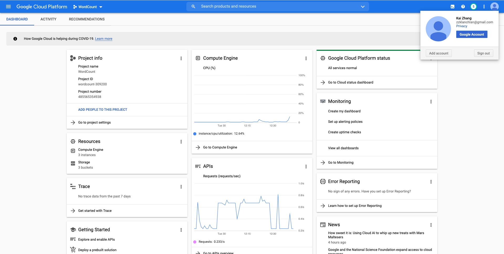
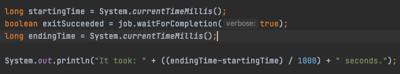
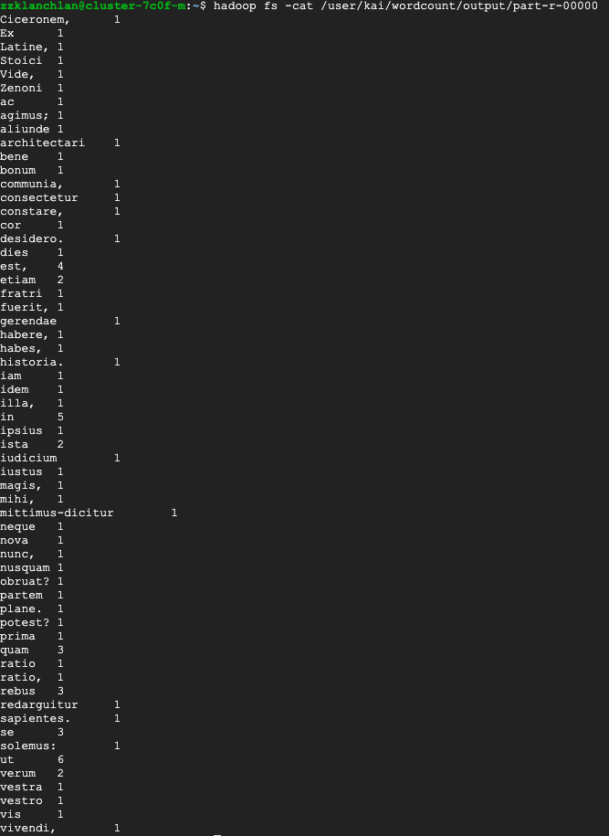
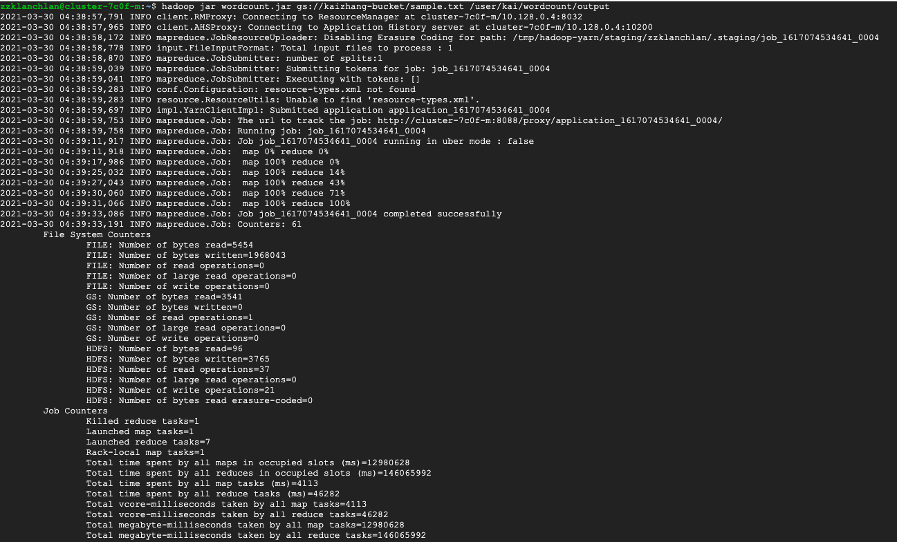
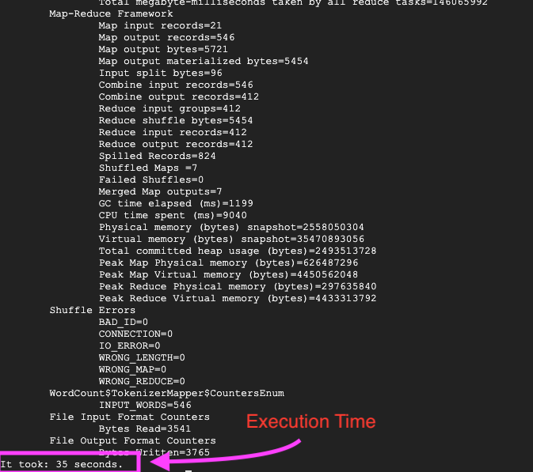

# cs1660-word-count-hw

## Screenshot of my GCP account

## Source code

My code (***WordCount.java***) is pushed onto this github repo.

How I calculate the execution time:

## Screen of the result

## Screens of the execution output

***It took 35 seconds to execute this program***
